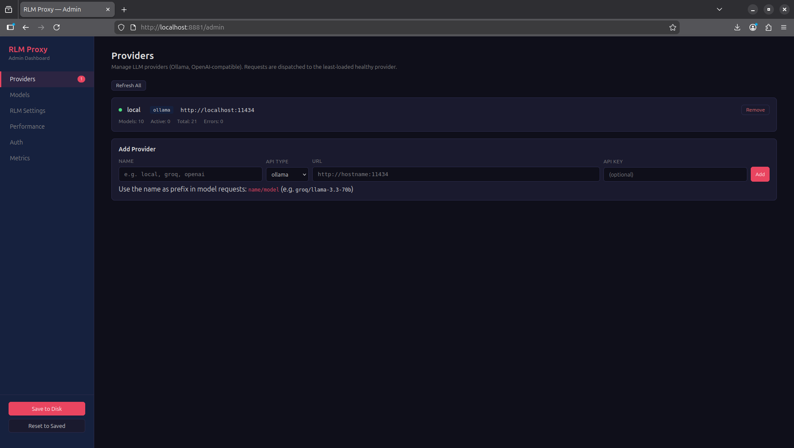
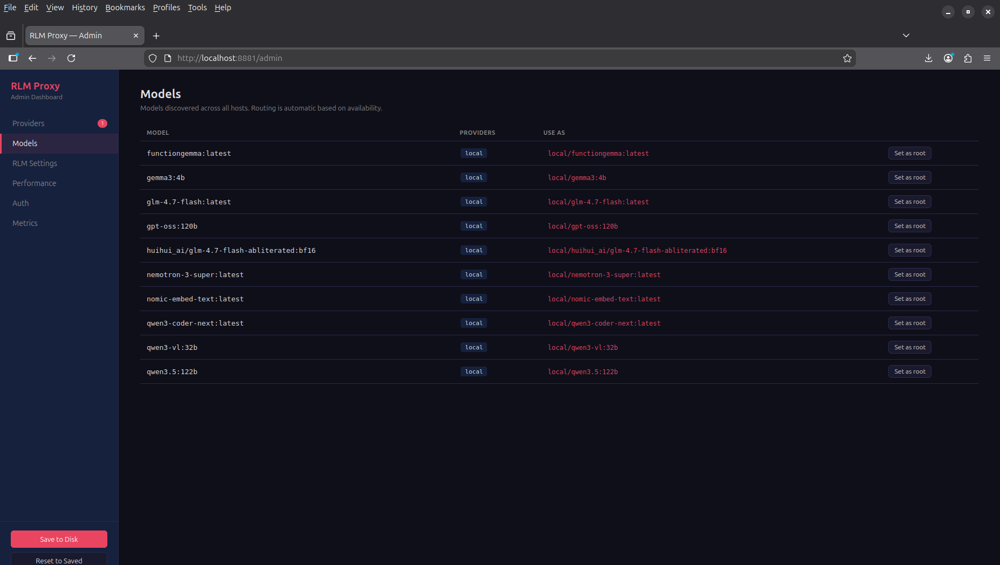
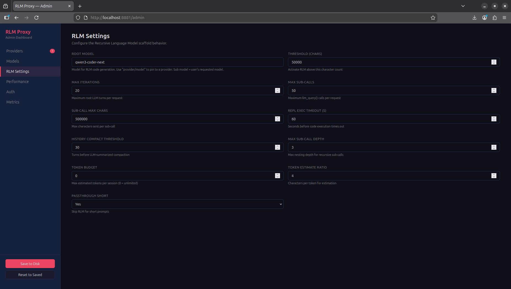
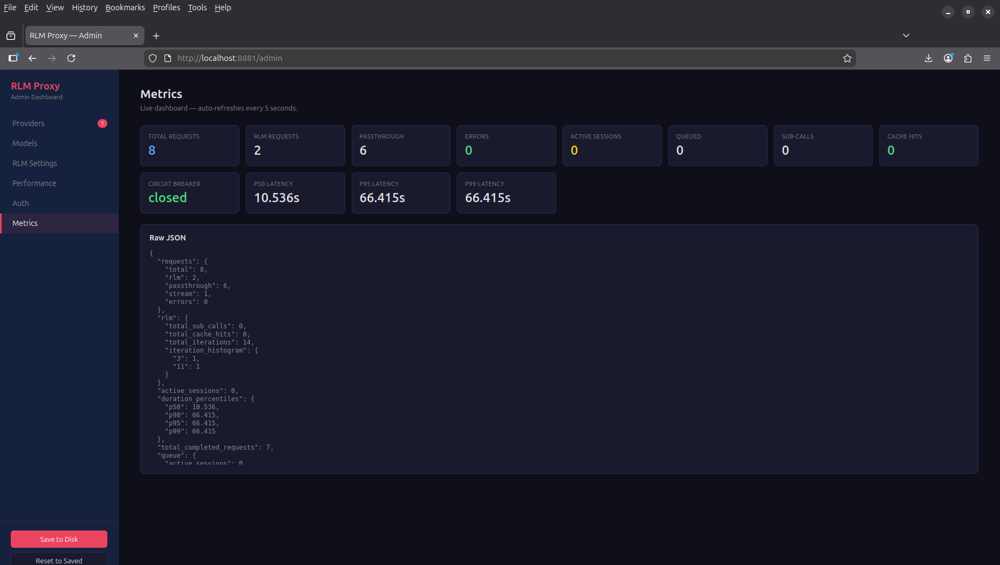

# RLM Proxy

An OpenAI-compatible proxy server that wraps local and remote LLMs with a **Recursive Language Model (RLM)** scaffold, enabling them to process inputs far beyond their native context window.

Based on the paper [Recursive Language Models](https://arxiv.org/abs/2512.24601) (Zhang, Kraska, Khattab — MIT CSAIL, 2025).

## How It Works

Standard LLMs have a fixed context window. When input exceeds it, performance degrades or the input is truncated. RLMs solve this by treating the prompt as **data in an external environment** rather than feeding it directly into the model.

```
Client (OpenAI or Ollama API)
        │
        ▼
   ┌─────────────────────────────────────────────┐
   │              RLM Proxy (:8881)               │
   │                                              │
   │  Auth ──► API key check (if configured)      │
   │                                              │
   │  Short prompt? ──► Direct passthrough        │
   │                                              │
   │  Long prompt?  ──► Request queue ──►         │
   │                    RLM scaffold activates:   │
   │                                              │
   │    1. Root model (coder) writes Python code  │
   │       in a sandboxed REPL                    │
   │                                              │
   │    2. Sub-calls use the user's requested     │
   │       model to process chunks                │
   │                                              │
   │    3. Loop until FINAL(answer) emitted       │
   │       (with stuck detection + early-stop)    │
   │                                              │
   └──────────┬─────────┬──────────┬──────────────┘
              │         │          │
              ▼         ▼          ▼
        ┌─────────┐ ┌────────┐ ┌──────────────┐
        │  local   │ │ Groq   │ │ Python REPL  │
        │  Ollama  │ │ OpenAI │ │ (sandboxed)  │
        │         │ │ etc.   │ │              │
        └─────────┘ └────────┘ └──────────────┘
   Providers: auto-discovery, least-loaded dispatch,
   circuit breaker, retry + backoff
```

### Model Routing: `provider/model`

Models are addressed as `provider/model` where the provider name maps to a configured backend:

```
"model": "local/qwen3-coder-next"       → your local Ollama
"model": "machine2/qwen3-coder-next"    → your second machine
"model": "groq/llama-3.3-70b"           → Groq API
"model": "openai/gpt-4o"                → OpenAI API
"model": "qwen3-coder-next"             → auto-dispatch (whoever has it)
```

### Root Model vs Sub Model

- **Root model** = writes Python code in the REPL. Needs strong coding ability. Configured once on the server (`RLM_ROOT_MODEL`), typically pinned to a local provider (e.g. `local/qwen3-coder-next`).
- **Sub model** = the user's requested model. Processes chunks via `llm_query()` / `llm_query_batch()`. No coding needed, just instruction-following. Can be local or remote.

The user just sends `{"model": "groq/llama-3.3-70b"}` — the proxy uses its configured root model for the coding loop and the user's model for sub-calls. The user gets answers from the model they chose.

### What the model does inside the RLM loop

The root LLM generates Python code in ` ```repl ``` ` blocks that gets executed in a persistent REPL. Common patterns:

- **Chunking**: splitting the context by lines, sections, or byte ranges
- **Searching**: using `re` / string methods to find relevant sections
- **Recursive sub-calls**: calling `llm_query(chunk)` to summarize, classify, or extract from each chunk
- **Parallel sub-calls**: calling `llm_query_batch(prompts)` to process multiple chunks concurrently
- **Aggregation**: combining sub-results into a final answer

Pre-loaded utility functions: `chunk_by_lines()`, `chunk_by_chars()`, `search()`, `count_tokens()`, `chunk_by_sections()`.

When done, the model emits `FINAL(answer)` or `FINAL_VAR(variable_name)` to return the result.

## Requirements

- Python 3.11+
- At least one LLM provider (local [Ollama](https://ollama.com), or remote OpenAI-compatible API)
- A root model with **strong coding ability**

## Setup

```bash
cd /path/to/rlm_proxy

# Create venv and install
python3 -m venv .venv
source .venv/bin/activate
pip install -e ".[test]"

# (Optional) Copy and edit config
cp .env.example .env
```

See **[INSTALL.md](INSTALL.md)** for the full installation guide including multi-provider setup, Docker, systemd service, connecting apps, and troubleshooting.

## Usage

### Start the server

```bash
python main.py
```

The server runs at `http://localhost:8881` by default.

- Admin dashboard: http://localhost:8881/admin
- API docs: http://localhost:8881/docs
- Health check: http://localhost:8881/health
- Metrics: http://localhost:8881/v1/rlm/metrics
- Dispatch info: http://localhost:8881/v1/rlm/dispatch

### Configure providers

Add providers via the admin UI at `/admin`, via `config.json`, or via API:

**config.json:**
```json
{
  "providers": [
    {"name": "local", "api_type": "ollama", "url": "http://localhost:11434"},
    {"name": "machine2", "api_type": "ollama", "url": "http://192.168.1.50:11434"},
    {"name": "groq", "api_type": "openai", "url": "https://api.groq.com/openai/v1", "api_key": "gsk-..."},
    {"name": "openai", "api_type": "openai", "url": "https://api.openai.com/v1", "api_key": "sk-..."}
  ],
  "root_model": "local/qwen3-coder-next"
}
```

**Via API:**
```bash
curl -X POST http://localhost:8881/v1/rlm/providers/add \
  -H "Content-Type: application/json" \
  -d '{"name": "groq", "api_type": "openai", "url": "https://api.groq.com/openai/v1", "api_key": "gsk-..."}'
```

**Legacy single-host (env vars):**
```bash
OLLAMA_BASE_URL=http://localhost:11434 python main.py
```

### Use with any OpenAI client

```python
from openai import OpenAI

client = OpenAI(
    base_url="http://localhost:8881/v1",
    api_key="your-key-here",  # or "unused" if RLM_API_KEY is not set
)

# Short prompt — passthrough directly
response = client.chat.completions.create(
    model="local/qwen3-coder-next",  # or just "qwen3-coder-next" for auto-dispatch
    messages=[{"role": "user", "content": "What is 2+2?"}],
)

# Long prompt — RLM activates automatically (>50K chars)
with open("very_long_document.txt") as f:
    document = f.read()

response = client.chat.completions.create(
    model="groq/llama-3.3-70b",  # sub-calls use this model
    messages=[{"role": "user", "content": f"Summarize this:\n\n{document}"}],
)
```

### Use with Ollama clients

Apps configured to talk to Ollama can point at the proxy — they get multi-provider dispatch for free:

```bash
# Instead of pointing at Ollama directly:
OLLAMA_HOST=http://localhost:8881 your-app

# Or use the Ollama-native endpoints directly:
curl http://localhost:8881/api/chat \
  -d '{"model": "local/qwen3-coder-next", "messages": [{"role": "user", "content": "Hello"}]}'
```

### Force RLM / passthrough mode

```bash
# Force RLM on short prompts
curl http://localhost:8881/v1/chat/completions \
  -H "Content-Type: application/json" \
  -d '{"model": "groq/llama-3.3-70b", "force_rlm": true, "messages": [...]}'

# Force passthrough on long prompts
curl http://localhost:8881/v1/chat/completions \
  -H "Content-Type: application/json" \
  -d '{"model": "local/qwen3-coder-next", "force_passthrough": true, "messages": [...]}'
```

### Streaming

SSE streaming works for both passthrough and RLM mode. In RLM mode, progress events stream during the iterative loop:

```bash
curl http://localhost:8881/v1/chat/completions \
  -H "Content-Type: application/json" \
  -d '{"model": "local/qwen3-coder-next", "stream": true, "messages": [...]}'
```

### Structured context

Pass multi-document context alongside messages:

```bash
curl http://localhost:8881/v1/chat/completions \
  -H "Content-Type: application/json" \
  -d '{
    "model": "groq/llama-3.3-70b",
    "force_rlm": true,
    "context": {"report.pdf": "...", "data.csv": "...", "notes.md": "..."},
    "messages": [{"role": "user", "content": "Compare these documents"}]
  }'
```

## Configuration

All settings are via environment variables, `.env` file, `config.json`, or the admin UI at `/admin`.

### Core Settings

| Variable | Default | Description |
|---|---|---|
| `OLLAMA_BASE_URL` | `http://localhost:11434` | Default Ollama URL (when no providers configured) |
| `RLM_OLLAMA_HOSTS` | *(empty)* | Comma-separated Ollama URLs (legacy multi-host) |
| `RLM_DISPATCHER_REFRESH_INTERVAL` | `60` | Seconds between model discovery refreshes |
| `RLM_ROOT_MODEL` | `qwen3-coder-next` | Root model for RLM code generation (use `provider/model` to pin) |
| `RLM_THRESHOLD_CHARS` | `50000` | Character count above which RLM activates |
| `RLM_MAX_ITERATIONS` | `20` | Max root LLM turns per request |
| `RLM_MAX_SUB_CALLS` | `50` | Max `llm_query()` calls per request |
| `RLM_SUB_CALL_MAX_CHARS` | `500000` | Max chars sent per sub-call |
| `RLM_EXEC_TIMEOUT` | `60` | Seconds timeout per REPL code execution |
| `RLM_HOST` | `0.0.0.0` | Server bind address |
| `RLM_PORT` | `8881` | Server port |
| `RLM_PASSTHROUGH_SHORT` | `true` | Skip RLM for short prompts |

### Performance

| Variable | Default | Description |
|---|---|---|
| `RLM_MAX_CONCURRENT_SUB_CALLS` | `4` | Max parallel sub-calls via `llm_query_batch()` |
| `RLM_SUB_CALL_CACHE_SIZE` | `128` | LRU cache size for sub-call results |
| `RLM_TOKEN_ESTIMATE_RATIO` | `4.0` | Characters per token (for estimation) |
| `RLM_TOKEN_BUDGET` | `0` | Max estimated tokens per session (0 = unlimited) |
| `RLM_MAX_SUB_CALL_DEPTH` | `3` | Max nesting depth for recursive sub-calls |

### Production Hardening

| Variable | Default | Description |
|---|---|---|
| `RLM_API_KEY` | *(empty)* | Bearer token for auth (empty = auth disabled) |
| `RLM_MAX_CONCURRENT_SESSIONS` | `2` | Max simultaneous RLM sessions |
| `RLM_MAX_QUEUE_SIZE` | `10` | Max queued RLM requests before rejecting (429) |
| `RLM_OLLAMA_MAX_RETRIES` | `3` | Retry attempts on transient failures |
| `RLM_OLLAMA_RETRY_BASE_DELAY` | `1.0` | Base delay (seconds) for exponential backoff |
| `RLM_CIRCUIT_BREAKER_THRESHOLD` | `5` | Consecutive failures before circuit opens |
| `RLM_CIRCUIT_BREAKER_TIMEOUT` | `30` | Seconds before circuit half-opens for probe |
| `RLM_HISTORY_COMPACT_THRESHOLD` | `30` | History turns before LLM-summarized compaction |

### Observability

| Variable | Default | Description |
|---|---|---|
| `RLM_METRICS_ENABLED` | `true` | Enable metrics collection |
| `RLM_TRAJECTORY_LOG_DIR` | *(empty)* | Directory for JSONL session logs (empty = disabled) |
| `RLM_PROMPT_PROFILE` | *(empty)* | Override auto-detected model prompt profile |

## API Endpoints

### OpenAI-compatible (`/v1/*`)

| Method | Path | Description |
|---|---|---|
| `POST` | `/v1/chat/completions` | Chat completions (supports `stream: true`) |
| `POST` | `/v1/embeddings` | Generate embeddings |
| `GET` | `/v1/models` | List available models (deduplicated across providers) |
| `GET` | `/v1/models/{model_id}` | Model details (family, parameter size, context length) |

### Ollama-native (`/api/*`)

Apps configured to talk to Ollama can point at the proxy instead — they get multi-provider dispatch, retry, and circuit breaking for free.

| Method | Path | Description |
|---|---|---|
| `POST` | `/api/chat` | Ollama chat (dispatched) |
| `POST` | `/api/generate` | Ollama generate (dispatched) |
| `POST` | `/api/embed` | Ollama embeddings (dispatched) |
| `POST` | `/api/show` | Ollama model info (dispatched) |
| `GET` | `/api/tags` | Ollama model list (aggregated) |

### Admin & Observability

| Method | Path | Description |
|---|---|---|
| `GET` | `/admin` | Admin dashboard (web UI) |
| `GET` | `/v1/rlm/config` | Current RLM configuration |
| `GET` | `/v1/rlm/config/all` | All settings as JSON |
| `PUT` | `/v1/rlm/config` | Update settings in memory |
| `POST` | `/v1/rlm/config/save` | Persist settings to `config.json` |
| `POST` | `/v1/rlm/config/reset` | Reload settings from env + `config.json` |
| `GET` | `/v1/rlm/metrics` | Request counts, latency percentiles, queue & circuit breaker |
| `GET` | `/v1/rlm/dispatch` | Provider routing table, per-provider stats |
| `POST` | `/v1/rlm/providers/add` | Add a new provider |
| `POST` | `/v1/rlm/providers/remove` | Remove a provider |
| `POST` | `/v1/rlm/hosts/refresh` | Re-probe all providers for models |
| `GET` | `/health` | Health check |

### Extra request fields

| Field | Type | Default | Description |
|---|---|---|---|
| `force_rlm` | `bool` | `false` | Force RLM mode regardless of input length |
| `force_passthrough` | `bool` | `false` | Force passthrough mode (skip RLM) |
| `context` | `str\|dict\|list\|null` | `null` | Structured context for multi-document processing |

## Testing

```bash
# Unit tests (no running server needed)
python -m pytest test_unit.py -v

# Integration tests (requires running server + at least one provider)
./test_proxy.sh                    # all tests
./test_proxy.sh health             # single test
./test_proxy.sh long_document      # 200K char needle-in-haystack
./test_proxy.sh concurrent         # 3 parallel requests
./test_proxy.sh --base http://host:port  # custom target
```

## Project Structure

```
rlm_proxy/
├── main.py              # FastAPI server + OpenAI/Ollama-compatible endpoints
├── config.py            # Settings (env vars / .env / config.json / admin UI)
├── schemas.py           # Pydantic request/response models
├── providers.py         # Provider abstraction (Ollama, OpenAI, extensible)
├── dispatcher.py        # Multi-provider dispatcher (auto-discovery, least-loaded)
├── ollama_client.py     # Unified LLM client (dispatch, retry, circuit breaker)
├── rlm_engine.py        # Core RLM loop (smart compaction, early-stop, streaming)
├── repl.py              # Sandboxed REPL (RestrictedPython, LRU cache, depth limits)
├── repl_utils.py        # Pre-loaded REPL helper functions
├── system_prompts.py    # RLM system prompts (adapted from the paper)
├── prompt_profiles.py   # Model-specific prompt customization
├── trajectory_logger.py # JSONL session logging for debugging + fine-tuning
├── metrics.py           # Thread-safe observability metrics
├── auth.py              # Bearer token authentication middleware
├── request_queue.py     # Session concurrency limiter + request queue
├── circuit_breaker.py   # Circuit breaker (closed/open/half-open)
├── admin.py             # Admin dashboard API + HTML serving
├── admin.html           # Self-contained admin web UI
├── test_unit.py         # Unit tests (69 tests, no server needed)
├── test_proxy.sh        # Integration test suite (curl-based)
├── test_rlm.py          # Original smoke tests
├── pyproject.toml       # Project metadata + dependencies
├── config.json          # Persisted settings + provider config (auto-generated)
└── .env.example         # Environment variable reference
```

## Key Features

### Multi-Provider Dispatch
Configure multiple LLM providers (local Ollama, Groq, OpenAI, OpenRouter, etc.) via `config.json` or the admin UI. The proxy auto-discovers available models on each provider and routes requests using `provider/model` syntax with least-loaded balancing. Unhealthy providers are automatically skipped.

### Dual API: OpenAI + Ollama
The proxy speaks both OpenAI (`/v1/*`) and Ollama (`/api/*`) formats. Apps using either SDK can point at the proxy and get multi-provider dispatch, retry, and circuit breaking — zero code changes needed.

### REPL Sandboxing
Code execution uses [RestrictedPython](https://restrictedpython.readthedocs.io/) with a whitelisted set of safe modules and builtins. Dangerous modules (`os`, `subprocess`, `sys`, `socket`) are blocked. Each code block runs with a configurable timeout.

### Parallel Sub-calls
`llm_query_batch(prompts)` sends multiple sub-LLM calls concurrently across providers, significantly reducing latency compared to sequential loops.

### Sub-call Caching
An LRU cache (SHA256-keyed) avoids redundant sub-calls. Cache hits skip the LLM entirely and don't count against the sub-call limit.

### Smart History Compaction
When conversation history grows beyond the threshold, a sub-LLM summarizes the removed turns — preserving the reasoning chain while staying within context limits.

### Adaptive Early-Stop
- **Premature convergence detection**: If the model produces `FINAL` too early on a large context, it's asked to verify.
- **Stuck detection**: If iterations show no progress, the model is redirected. If still stuck, the best available answer is forced.

### Admin Dashboard
Web-based admin UI at `/admin` for managing providers, editing all settings, viewing live metrics, and browsing the model routing table. Changes can be applied in-memory (session-only) or saved to disk.


*Manage providers — add/remove Ollama instances, OpenAI-compatible APIs, see health and load*


*Model routing table — see which providers serve each model, copy `provider/model` strings, set root model*


*RLM settings — configure thresholds, iterations, token budgets, root model with autocomplete*


*Live metrics dashboard — request counts, latency percentiles, cache hits, circuit breaker state*

### Circuit Breaker + Retry
Exponential backoff retry on transient failures. Circuit breaker prevents cascading failures when a provider is down — requests fail fast with `Retry-After` headers.

### Request Queue
Limits concurrent RLM sessions with a bounded queue. Excess requests get 429 responses instead of overwhelming providers.

## References

- Paper: [Recursive Language Models](https://arxiv.org/abs/2512.24601) — Zhang, Kraska, Khattab (MIT CSAIL, Jan 2025)
- Reference implementation: https://github.com/alexzhang13/rlm
- Ollama: https://ollama.com

---

*P.S. — If this project looks like we shamelessly copied from the original RLM authors... that's because we absolutely did. :D Thank you Alex Zhang, Tim Kraska, and Omar Khattab for the brilliant paper and reference implementation that made this possible. We just added some plumbing around your great idea.*
